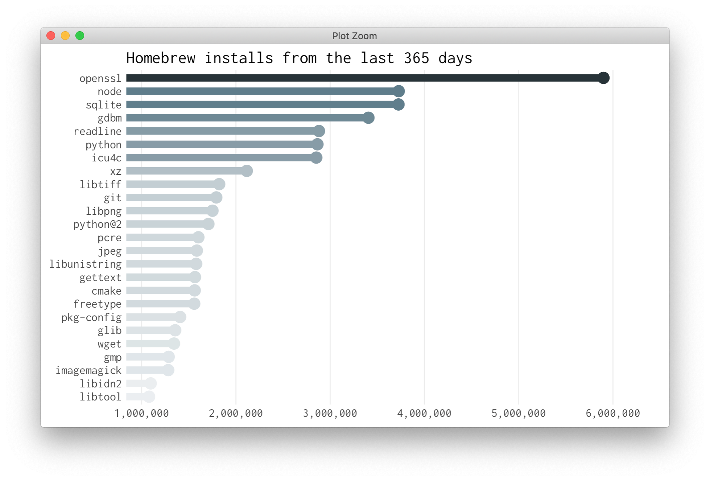

<!-- README.md is generated from README.Rmd. Please edit that file -->

# brewr 

[](https://travis-ci.org/tyluRp/brewr)
[](https://ci.appveyor.com/project/tyluRp/brewr)
[](https://codecov.io/gh/tyluRp/brewr?branch=master)

The goal of brewr is to access [Homebrews JSON
API](https://formulae.brew.sh/docs/api/) in R.



## Installation

You can install brewr from github using
[`devtools`](https://github.com/r-lib/devtools) with:

``` r
devtools::install_github("tylurp/brewr")
```

## Example

Use the `brewr()` function to access all API endpoints. The endpoints
are listed in the [documentation](https://formulae.brew.sh/docs/api/).

The first argument of `brewr()` is the endpoint. Note that the leading
slash must be included as well.

``` r
library(brewr)

# Pull metrics on macOS versions
os_versions <- brewr("/analytics/os-version/30d")

# Default output is JSON
os_versions
#> {
#>   "category": "install",
#>   "total_items": 10,
#>   "start_date": "2018-10-18",
#>   "end_date": "2018-11-17",
#>   "total_count": 14301111,
#>   "items": [
#>     {
#>       "number": 1,
#>       "os_version": "macOS Mojave (10.14)",
#>       "count": "7,105,424",
#>       "percent": "49.68"
#>     },
#>     {
#>       "number": 2,
#>       "os_version": "macOS High Sierra (10.13)",
#>       "count": "5,421,027",
#>       "percent": "37.91"
#>     },
#>     {
#>       "number": 3,
#>       "os_version": "macOS Sierra (10.12)",
#>       "count": "1,143,225",
#>       "percent": "7.99"
#>     },
#>     {
#>       "number": 4,
#>       "os_version": "OS X El Capitan (10.11)",
#>       "count": "473,140",
#>       "percent": "3.31"
#>     },
#>     {
#>       "number": 5,
#>       "os_version": "OS X Yosemite (10.10)",
#>       "count": "137,703",
#>       "percent": "0.96"
#>     },
#>     {
#>       "number": 6,
#>       "os_version": "OS X Mavericks (10.9)",
#>       "count": "18,489",
#>       "percent": "0.13"
#>     },
#>     {
#>       "number": 7,
#>       "os_version": "macOS (10.15)",
#>       "count": "1,109",
#>       "percent": "0.01"
#>     },
#>     {
#>       "number": 8,
#>       "os_version": "Mac OS X Lion (10.7)",
#>       "count": "482",
#>       "percent": "0.00"
#>     },
#>     {
#>       "number": 9,
#>       "os_version": "OS X Mountain Lion (10.8)",
#>       "count": "372",
#>       "percent": "0.00"
#>     },
#>     {
#>       "number": 10,
#>       "os_version": "Mac OS X Snow Leopard (10.6)",
#>       "count": "140",
#>       "percent": "0.00"
#>     }
#>   ]
#> }

# Convert JSON to an R object with jsonlite
os_versions <- jsonlite::fromJSON(os_versions)
os_versions[["items"]]
#>    number                   os_version     count percent
#> 1       1         macOS Mojave (10.14) 7,105,424   49.68
#> 2       2    macOS High Sierra (10.13) 5,421,027   37.91
#> 3       3         macOS Sierra (10.12) 1,143,225    7.99
#> 4       4      OS X El Capitan (10.11)   473,140    3.31
#> 5       5        OS X Yosemite (10.10)   137,703    0.96
#> 6       6        OS X Mavericks (10.9)    18,489    0.13
#> 7       7                macOS (10.15)     1,109    0.01
#> 8       8         Mac OS X Lion (10.7)       482    0.00
#> 9       9    OS X Mountain Lion (10.8)       372    0.00
#> 10     10 Mac OS X Snow Leopard (10.6)       140    0.00

# Pull install metrics from the last 30 days
installs <- brewr("/analytics/install/30d")
installs <- jsonlite::fromJSON(installs)[["items"]]
head(installs, 10)
#>    number  formula   count percent
#> 1       1   sqlite 424,108    2.95
#> 2       2  openssl 418,380    2.91
#> 3       3     gdbm 408,236    2.84
#> 4       4   python 325,328    2.27
#> 5       5     node 325,239    2.27
#> 6       6 readline 288,910    2.01
#> 7       7       xz 219,196    1.53
#> 8       8    icu4c 199,736    1.39
#> 9       9  gettext 178,141    1.24
#> 10     10  libtiff 160,465    1.12
```
